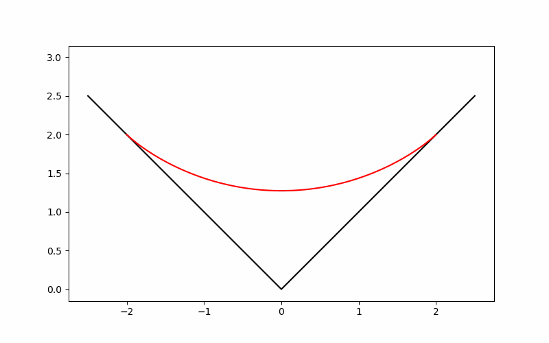
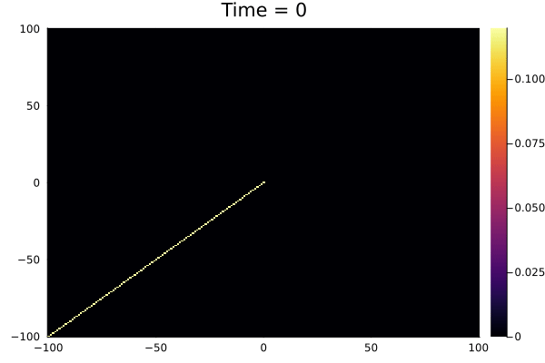

# Gallery

## Random Young diagrams

### Limit shape phenomena of the Plancherel distributed random Young diagrams

## Random matrices

### Wigner's theorem for GUE

## Correlations of free fermions

### Density of free fermions with the domain-wall initial state

### Two point correlations with the domain-wall initial state

### Density of free fermions with the alternating state

### Two point correlations with the alternating initial state

