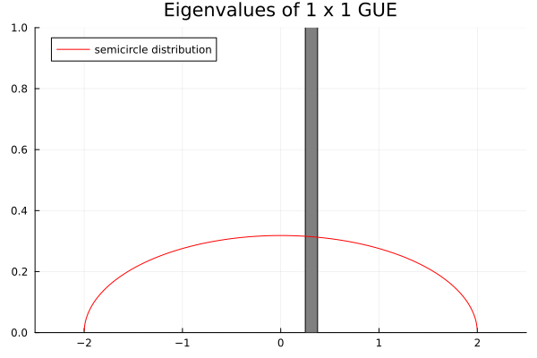
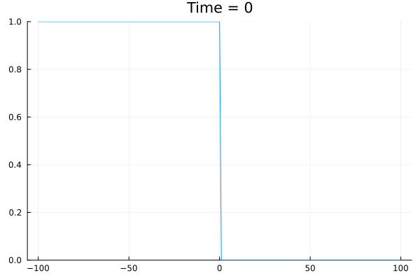
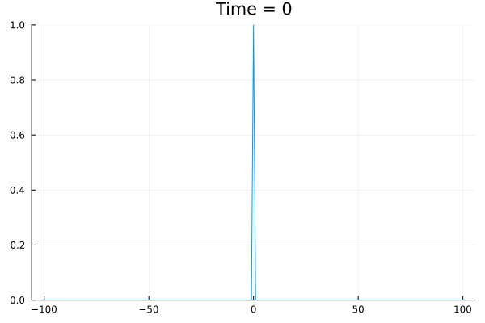

# Gallery

- [Gallery](#gallery)
  - [Random Young diagrams](#random-young-diagrams)
    - [Limit shape phenomena of the Plancherel distributed random Young diagrams](#limit-shape-phenomena-of-the-plancherel-distributed-random-young-diagrams)
  - [Random matrices](#random-matrices)
    - [Wigner's theorem for GUE](#wigners-theorem-for-gue)
  - [Correlations of free fermions](#correlations-of-free-fermions)
    - [Density of free fermions with the domain-wall initial state](#density-of-free-fermions-with-the-domain-wall-initial-state)
    - [Two point correlations with the domain-wall initial state](#two-point-correlations-with-the-domain-wall-initial-state)
    - [Density of free fermions with the alternating state](#density-of-free-fermions-with-the-alternating-state)
    - [Two point correlations with the alternating initial state](#two-point-correlations-with-the-alternating-initial-state)

## Random Young diagrams

### Limit shape phenomena of the Plancherel distributed random Young diagrams

## Random matrices

### Wigner's theorem for GUE

## Correlations of free fermions

### Density of free fermions with the domain-wall initial state

### Two point correlations with the domain-wall initial state

### Density of free fermions with the alternating state

### Two point correlations with the alternating initial state

