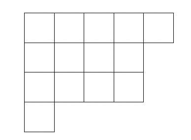
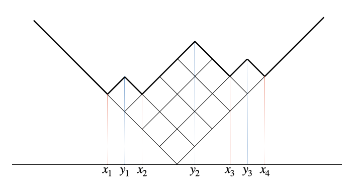
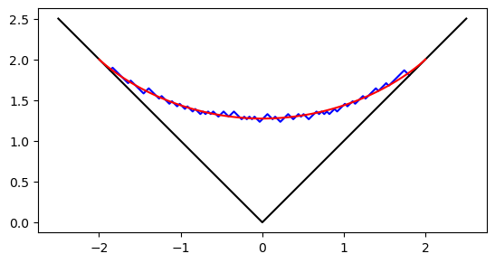
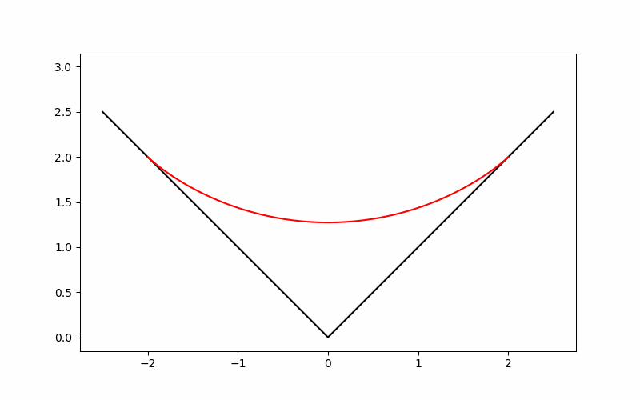

# Plancherel growth of Young diagrams

- [Plancherel growth of Young diagrams](#plancherel-growth-of-young-diagrams)
  - [Plancherel measures](#plancherel-measures)
  - [Young diagrams and Symmetric groups](#young-diagrams-and-symmetric-groups)
    - [Young diagrams](#young-diagrams)
    - [Symmetric groups](#symmetric-groups)
  - [Plancherel growth of Young diagrams](#plancherel-growth-of-young-diagrams-1)
  - [Limit shape](#limit-shape)
  - [Programming simulation](#programming-simulation)
  - [Result](#result)


## Plancherel measures
Let $G$ be a finite group and $\widehat G$ the set of all (equivalence classes of) irreducible representations of $G$. For any $\lambda\in \widehat G$ we denote by $d_\lambda$ the dimension of the associated irreducible representation. In the representation theory, it is well known that 
$$|G|=\sum_{\lambda\in \widehat G}d_\lambda^2.$$
Therefore, we obtain a probability measure $\mathbb{P}_\mathrm{Pl}$ on $\widehat G$ by 
$$\mathbb{P}_\mathrm{Pl}(\lambda):=\frac{d_\lambda^2}{|G|} \quad (\lambda \in \widehat G).$$
This probability measure $\mathbb{P}_\mathrm{Pl}$ is called the `Plancherel measure` of $G$.

## Young diagrams and Symmetric groups 
### Young diagrams
A `Young diagram` is a non-increasing sequence $\lambda=(\lambda_1\geq \lambda_2\geq \cdots)$ of nonnegative integers such that $|\lambda|:=\sum_{i=1}^\infty\lambda_i<\infty$. We call $|\lambda|$ the `size` of $\lambda$. By definition, there exists an integer $l(\lambda)\geq 0$, called the `length` of $\lambda$, such that $\lambda_{l(\lambda)}\neq 0$ and $\lambda_{l(\lambda)+1}=0$.

Let $\mathbb{Y}_N$ denote the set of Young diagrams with size $N$. Usually, a Young diagram $\lambda\in \mathbb{Y}_N$ is represented as a diagram, which consists of $N$ boxes arranged in left-justified rows. The number of boxes in each rows is $\lambda_1, \lambda_2, \dots$ from top to bottom. For instance, $\lambda=(5, 4, 4, 1)$ is represented by the following diagram:



In analysis, the following rotated (and reflected) display is also useful:



We assume that the edge length of each box is $\sqrt{2}$. The bold line is called the `profile` of a Young diagram $\lambda$. We denote by $x_1, x_2, \dots, x_r$ and $y_1, y_2, \dots, y_{r-1}$ the local minima and local maxima of the profile, respectively. By assumption, they are integers. Moreover, the following interlacing inequalities holds:
$$
x_1<y_1<x_2<\cdots <y_{r-1}<x_r.
$$
We call them the `min-max coordinate` of $\lambda$. We remark that Young diagrams are implemented as those min-max coordinates in the coding below. The following characterization of min-max coordinates is known: An interlacing integers $x_1<y_1<x_2<\cdots <y_{r-1}<x_r$ is the min-max coordinate of some Young diagram if and only if 
$$
\sum_{i=1}^rx_i-\sum_{i=1}^{r-1}y_i=0
$$
holds.

### Symmetric groups
Let $S(N)$ denote the symmetric group of degree $N$. In the representation theory, it is well known that $\widehat{S(N)}$ is parametrized by $\mathbb{Y}_N$. Thus, the Plancherel measure of $S(N)$ is identified with a probability measure on $\mathbb{Y}_N$.

Let us mention an explicit formula of the Plancherel measure of $S(N)$. We remark that this formula is not used in the coding below. Instead of this, we realize the Plancherel measure of $S(N)$ by the `interval shrinkage algorithm` suggested by S. V. Kerov.

For any Young diagram $\lambda$ we denote by $\lambda'$ its `transpose`, that is, $\lambda'$ is obtained by replacing columns and rows of $\lambda$. More precisely, we have
$$\lambda'_i=|\{j\geq 0\mid \lambda_j\geq i\}|\quad (i=1, 2, \dots)$$


We denote by $d_\lambda$ the dimension of the irreducible representation of $S(N)$ labeled by $\lambda\in \mathbb{Y}_N$. The following `hook-lenght formula` is well known:
$$
d_\lambda = \frac{N!}{\prod_{i=1}^{l(\lambda)}\prod_{j=1}^{\lambda_i}(\lambda_i-i+\lambda'_j-j+1)}.
$$
Since $|S(N)|=N!$, we obtain the following explicit formula of the Plancherel measure $\mathbb{P}_\mathrm{Pl}$ of $S(N)$:
$$
\mathbb{P}_\mathrm{Pl}(\lambda) = \frac{N!}{\prod_{i=1}^{l(\lambda)}\prod_{j=1}^{\lambda_i}(\lambda_i-i+\lambda'_j-j+1)^2} \quad (\lambda\in \mathbb{Y}_N).
$$

## Plancherel growth of Young diagrams
For $\lambda\in\mathbb{Y}_N$ and $\nu\in\mathbb{Y}_{N+1}$, we write $\lambda\nearrow \nu$ when $\nu$ is obtained by adding one box to $\lambda$. We consider a growth process of Young diagrams 
$$\lambda^{(1)}\nearrow \lambda^{(2)}\nearrow\cdots.$$
If this growth occurs randomly and $\lambda^{(N)}$ is distributed by the Plancherel measure of $S(N)$ for each $N\geq1$, we call this growth a `Plancherel growth`.

In the actual coding, we will realize a Plancherel growth by the `interval shrinkage algorithm` suggested by S. V. Kerov. Let us explain this here. First, we assume that $\lambda$ is a current Young diagram. Let $x_1<y_1<x_2<\cdots <y_{r-1}<x_r$ denote the min-max coordinate of $\lambda$. To obtain a new Young diagram, we should choose one of the local minima $x_1, \dots, x_r$ and add one box to this point. By the interval shrinkage algorithm, we will determine one of the local minima $x_1, \dots, x_r$. We first have the interval $[x_1, x_r]$ and take $X_1$ uniformly distributed in $[x_1, x_r]$. Then, we shrink our interval $[x_1, x_r]$ by the following rule. If $x_i<X<y_i$, then the next shrank interval is $[x_1, x_i]$. If $y_i<X<x_{i+1}$, then the next shank interval is $[x_{i+1}, x_r]$. In the next step, we apply the same shrinkage procedure for the resulting interval. We continue these steps until the interval shrinks to one point. Moreover, the resulting point is a point we seek to add a box.

## Limit shape
Let $(\lambda^{(N)})_{N\geq1}$ be a Plancherel growth sequence of Young diagrams.  For each $N\geq 1$ we denote by $\omega_{\lambda^{(N)}}$ the profile of $\lambda^{(N)}$. Namely, $\omega_{\lambda^{(N)}}$ is a piecewise linear function on $\mathbb{R}$ such that its slope is $\pm 1$ for all but finitely many $x\in \mathbb{R}$, and we have $\omega_{\lambda^{(N)}}(x)=|x|$ when $|x|$ is sufficiently large. Moreover, we scale $\omega_{\lambda^{(N)}}$ by $1/\sqrt{N}$ in both directions, that is, take $\omega_{\lambda^{(N)}}(x/\sqrt{N})/\sqrt{N}$.

Vershik and Kerov and, independently, Logan and Shepp discovered the following limit shape phenomenon. As $N\to \infty$, the scaled profiles $\omega_{\lambda^{(N)}}(x/\sqrt{N})/\sqrt{N}$ "converge" to the function $\Omega(x)$ defined as 
$$
\Omega(x):=\begin{cases}\frac{2}{\pi}(x \mathrm{arcsin}(x/2)+\sqrt{4-x^2} & |x|\leq 2,\\ |x| & |x|>2.\end{cases}
$$

The purpose of the coding below is to demonstrate this limit shape phenomenon.

## Programming simulation
The following code is written by `Python`. We need the following modules.

``` python
import numpy as np
import matplotlib.pyplot as plt
import matplotlib.animation as animation
```

In what follows, `mins` and `maxs` can be regarded as min-max coordinates of Young diagrams. If we want to display a Young diagram from its min-max coordinate (i.e., `mins` and `maxs`), it is necessary to compute the $xy$-coordinates of the profile's minima and maxima.
``` python
def x_axis_func (mins, maxs):
    return np.sort(np.append(mins, maxs))
x_axis = x_axis_func(mins, maxs)

def height_array (mins, maxs):
    if(len(maxs)==0):
        return np.array([np.abs(mins[0])])
    else:
        assert len(mins) >=2, f"{mins} ?"
        h = height_array(mins[:-1], maxs[:-1])
        b = h[-1] + maxs[-1] - mins[-2]
        tail = np.array([b, b - mins[-1] + maxs[-1]])
        return np.append(h, tail)
```
Following the interval shrinkage algorithm, `add_point` function determines a  point where add a box to create a new Young diagram. In `plancherel_growth` function, `add_point` function first run, and then, the min-max coordinate of new Young diagram is computed.
```python
def add_point(mins, maxs):
    x_min = mins[0]
    x_max = mins[-1]

    while x_min != x_max:
        u=np.random.uniform(x_min, x_max)
        i_x = np.count_nonzero(mins < u)
        i_y = np.count_nonzero(maxs < u)
        if(i_x == i_y):
            x_min = mins[i_x]
        else:
            x_max = mins[i_x-1]

    return x_max

# %%
def plancherel_growth(mins, maxs):
    x_add = add_point(mins, maxs)
    i = np.count_nonzero(maxs < x_add)
    if(mins[i]-1 in maxs):
        new_maxs = np.sort(np.append(np.delete(maxs, i-1), mins[i]))
        new_mins = np.sort(np.append(np.delete(mins, i), mins[i]+1))
    elif(mins[i]+1 in maxs):
        new_maxs = np.sort(np.append(np.delete(maxs, i), mins[i]))
        new_mins = np.sort(np.append(np.delete(mins, i), mins[i]-1))
    else:
        new_maxs = np.sort(np.append(maxs, mins[i]))
        new_mins = np.sort(np.append(np.delete(mins, i), np.array([mins[i]-1, mins[i]+1])))
    return new_mins, new_maxs
```
`MINS_ORIGIN` and `MAXS_ORIGIN` specify an initial Young diagram, that is, the Young diagram of one box. By `plancherel_growth` function, `limit_shape_sim` function executes a growth of Young diagrams from one box to `SIM_TIME` boxes. The resulting min-max coordinate is assigned in `result_diag`.
``` python
MINS_ORIGIN = np.array([-1, 1])
MAXS_ORIGIN = np.array([0])

SIM_TIME = 1000

def limit_shape_sim (time, mins_origin, maxs_origin):
    new_diag = (mins_origin, maxs_origin)
    for t in range(time):
        new_diag = plancherel_growth(new_diag[0], new_diag[1])
    return new_diag
    
result_diag = limit_shape_sim(SIM_TIME, MINS_ORIGIN, MAXS_ORIGIN)
```
## Result
We can display the resulting (scaled) Young diagram. 
```python
x_axis = x_axis_func(result_diag[0], result_diag[1]) * (1.0/np.sqrt(SIM_TIME))
height = height_array(result_diag[0], result_diag[1]) * (1.0/np.sqrt(SIM_TIME))

x_sample = np.linspace(-2, 2, 100)
vkls = (2.0/np.pi)*(x_sample*np.arcsin(x_sample/2)+np.sqrt(4-x_sample**2))

plt.axes().set_aspect('equal')
plt.plot(x_axis, height, color="blue")
plt.plot([-2.5, 0, 2.5], [2.5, 0, 2.5], color="black")
plt.plot(x_sample, vkls, color="red")
```
We can obtain the following image and can compare the scaled profile and the Vershik--Kerov--Logan--Shepp curve.



If we want to see an aspects of growth and convergence to the limit shape, we can create a gif image as follows.
```python
fig = plt.figure(figsize=(8, 5))

x_sample = np.linspace(-2, 2, 100)
vkls = (2.0/np.pi)*(x_sample*np.arcsin(x_sample/2)+np.sqrt(4-x_sample**2))

SIM_TIME = 1000
MINS_ORIGIN = np.array([-1, 1])
MAXS_ORIGIN = np.array([0])

diag = (MINS_ORIGIN, MAXS_ORIGIN)

images = []
plt.axes().set_aspect('equal')

for t in range(SIM_TIME):
    x_axis = x_axis_func(diag[0], diag[1])
    height = height_array(diag[0], diag[1])

    x_axis_scal = x_axis*(1.0/np.sqrt(t))
    height_scal = height*(1.0/np.sqrt(t))

    image1 = plt.plot(x_axis_scal, height_scal, color="blue")
    image2 = plt.plot([-2.5, 0, 2.5], [2.5, 0, 2.5], color="black")
    image3 = plt.plot(x_sample, vkls, color="red")
    images.append(image1 + image2 + image3)

    diag = plancherel_growth(diag[0], diag[1])

anime = animation.ArtistAnimation(fig, images, interval=40, blit=True, repeat_delay=0)
anime.save("plancherel_growth.gif", writer="pillow")
plt.show()
```

We obtain the following gif image.


